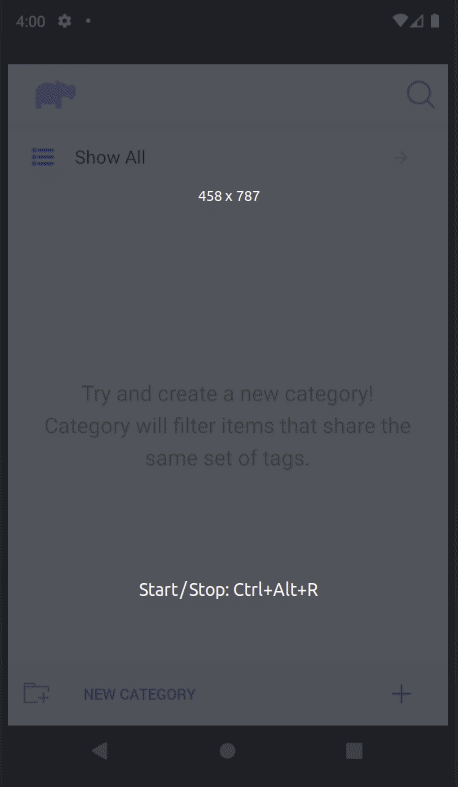
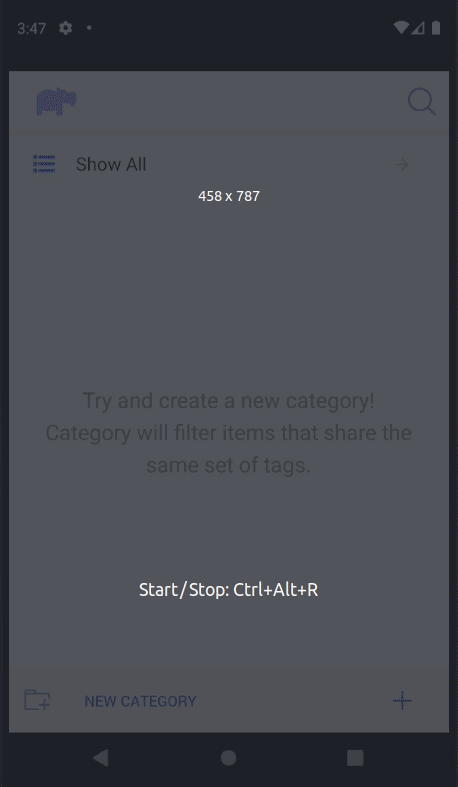
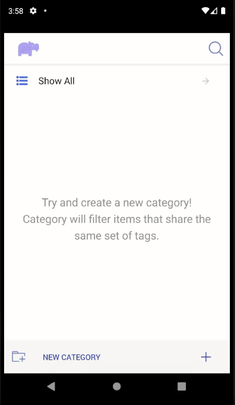
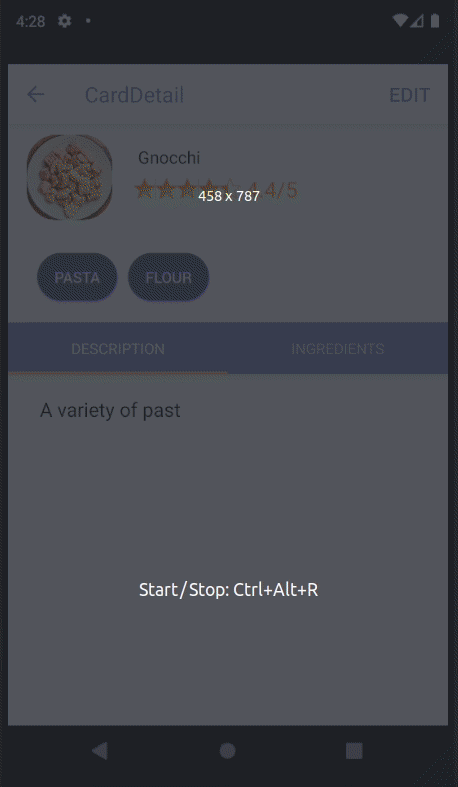

# Foodie List

## Overview

A notebook for recording food you came across and like. For each recipe, users can rate it, upload a picture, jot down ingredients and write a description. Users can search for recipes by their name or assigned tags for finding something they want quickly. It is also possible to organize recipes into different categories by their assigned tags for ease of access.

This app is built on [Expo](https://docs.expo.io/). [NativeBase](https://nativebase.io/) components are used to help construct some of the scenes. [React Navigation](https://reactnavigation.org/) is used to manage the transition between different screens. To view the demo, visit [https://expo.io/@moa_novae/foodie_list](https://expo.io/@moa_novae/foodie_list). Currently, the app has only been tested on Android.

## Demo

### View recipe

### Create new category

Recipes will fall under categories that share the same tags.

### Create new recipe

### Edit/Delete recipe

